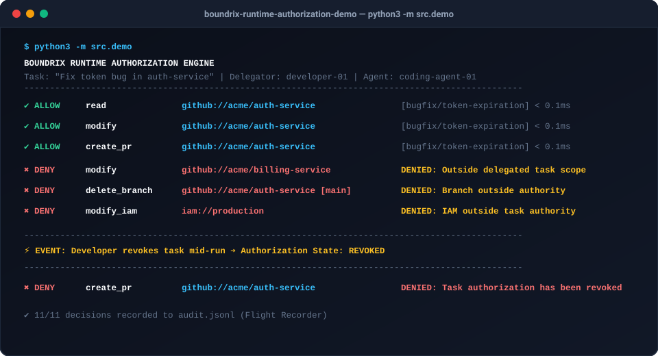

<div align="center">

# 🛡️ Boundrix Runtime Authorization Demo

**Deterministic Runtime Authorization & Execution Boundaries for Autonomous AI Agents**

[](tests/)
[](https://python.org)
[](LICENSE)
[](https://boundrix.io)

<br/>

> **An autonomous AI agent may hold valid API credentials, but still attempt actions outside the specific task it was delegated to perform.**

</div>

---

## ⚡ The 30-Second Overview

```text
                           Developer
                               │
                               │ Task: "Fix token bug in auth-service"
                               ▼
                       AI Coding Agent
                               │
                               ▼
    [ Boundrix Runtime Authorization Boundary ] ── Evaluates at Execution Boundary (<1ms)
                               │
            ┌──────────────────┴──────────────────┐
            ▼                                     ▼
       ✅ ALLOW                               ❌ DENY (Execution Halted)
  • Read auth-service                    • Modify billing-service (Scope-Creep)
  • Modify auth-service                  • Delete main branch (Destructive Action)
  • Run unit tests                       • Modify IAM (Privilege Escalation)
  • Create Pull Request                  • Any action after Task Revocation (Kill Switch)
```

<br/>

<div align="center">
  
</div>

<br/>

---

## 🎯 The Core Concept: Identity Permission ≠ Task Authority

```text
Traditional IAM (Okta, GitHub RBAC, AWS IAM):
"coding-agent-01 holds a permanent token with write access to all repositories."

Boundrix Runtime Authorization:
"coding-agent-01 may ONLY modify auth-service on branch bugfix/*
for task-001 under developer-01's delegation while the task is ACTIVE.
Any attempt to touch billing-service, main branch, or IAM is DENIED in real-time."
```

| Dimension | Traditional IAM | Boundrix Runtime Authorization |
| :--- | :--- | :--- |
| **Question Answered** | *"Who is this identity and what are its global permissions?"* | *"Should this specific action execute for this active task right now?"* |
| **Scope Lifetime** | Permanent / Long-lived keys | Ephemeral, task-bound (15–60 min) |
| **Enforcement Point** | Front-door login & token issuance | At the execution boundary immediately before each tool call |
| **Branch & Scope Scoping** | Broad read/write access | Confined strictly to `bugfix/*` and assigned repository |
| **Kill Switch** | Emergency manual token rotation | Instant task revocation denying the next tool call (<5ms) |

---

## 🚀 10-Second Quickstart

```bash
# 1. Clone the repository
git clone https://github.com/sasilabs/boundrix-runtime-authorization-demo.git
cd boundrix-runtime-authorization-demo

# 2. Setup environment & install test runner
python3 -m venv .venv
source .venv/bin/activate
pip install -r requirements.txt

# 3. Run the visual demo
python3 -m src.demo
```

---

## 🎮 Interactive Mode (Try It Yourself)

Run the live interactive prompt to test arbitrary actions, repositories, and branches against the policy engine:

```bash
python3 -m src.interactive
```

### Try These 4 Test Scenarios:

| Scenario | Action | Target Resource | Branch | Result | Reason |
| :--- | :--- | :--- | :--- | :---: | :--- |
| **1. Permitted Bugfix** | `modify` | `github://acme/auth-service` | `bugfix/token-expiration` | **`ALLOW` ✅** | Resource, action, and branch match task delegation. |
| **2. Scope-Creep Attack** | `modify` | `github://acme/billing-service` | `bugfix/token-expiration` | **`DENY` ❌** | Resource is outside delegated task scope. |
| **3. Protected Branch** | `modify` | `github://acme/auth-service` | `main` | **`DENY` ❌** | Branch is outside delegated authority (`bugfix/*`). |
| **4. Instant Kill Switch** | *(Type `revoke`)* | Any resource (`auth-service`) | Any branch | **`DENY` ❌** | Task authorization has been revoked. |

*(Type `activate` to re-enable the task at any time).*

---

## 📋 Where Policy is Defined

Permissions are defined in human-readable, task-scoped policies (`policies/coding_agent_policy.json`):

```json
{
  "policy_id": "coding-agent-task-policy",
  "task": "Fix auth bug in auth-service and create a pull request",
  "allowed_resources": [
    "github://acme/auth-service"
  ],
  "allowed_actions": [
    "read",
    "modify",
    "create_branch",
    "run_tests",
    "create_pull_request"
  ],
  "allowed_branches": [
    "bugfix/*"
  ],
  "denied_resources": [
    "github://acme/billing-service",
    "iam://*"
  ],
  "denied_actions": [
    "delete_branch",
    "modify_iam"
  ],
  "authorized_delegation_paths": [
    ["developer-01", "coding-agent-01"],
    ["developer-01", "coding-agent-01", "github-tool"]
  ]
}
```

---

## ⚡ Mid-Task Revocation (Real-Time Kill Switch)

Boundrix allows supervisors to revoke authority **while an agent workflow is actively running**:

```text
========================================================
MID-TASK REVOCATION DEMO
========================================================

Task: Fix auth bug in auth-service
Initial State: ACTIVE

Action: modify auth-service
Decision: ALLOW ✅

--------------------------------------------------------
Developer revokes task ➔ Authorization State: REVOKED
--------------------------------------------------------

Agent attempts: create_pull_request
Decision: DENY ❌
Reason: Task authorization has been revoked
```

> **Execution Boundary Note**: Boundrix denies the *next* protected action when re-evaluated at the execution boundary. It does not require rotating master provider tokens or killing operating system processes.

---

## ⛓️ Lineage & Delegation Verification

Authorization requests carry provenance context (`delegation_path`). If an unexpected or unauthorized tool is injected into the delegation chain, the engine rejects the request:

```text
Expected Delegation Path:
developer-01 ➔ coding-agent-01 ➔ github-tool
Decision: ALLOW ✅

Unexpected Delegation Path:
developer-01 ➔ coding-agent-01 ➔ privileged-admin-tool
Decision: DENY ❌
Reason: Delegation path is not authorized for this task
```

---

## 📜 Audit Flight Recorder

Every authorization decision produces an auditable record logged to `audit.jsonl`:

```json
{
  "timestamp": "2026-10-07T11:45:00.123456+00:00",
  "authorization_id": "authz-005",
  "request_id": "req-005",
  "task_id": "task-001",
  "identity": { "type": "agent", "id": "coding-agent-01" },
  "delegator": { "type": "human", "id": "developer-01" },
  "delegation_path": ["developer-01", "coding-agent-01"],
  "resource": "github://acme/billing-service",
  "action": "modify",
  "decision": "DENY",
  "reason": "Resource is outside delegated task scope",
  "policy_id": "coding-agent-task-policy"
}
```

---

## 🧪 Automated Tests

Run the complete test suite:

```bash
pytest
```

```text
============================= test session starts ==============================
collected 8 items

tests/test_authorization.py .....                                        [ 62%]
tests/test_delegation.py ..                                              [ 87%]
tests/test_revocation.py .                                               [100%]

============================== 8 passed in 0.03s ===============================
```

---

## 🏗️ Repository Architecture

```text
boundrix-runtime-authorization-demo/
│
├── README.md                      # Comprehensive guide & visual walkthrough
├── LICENSE                        # Apache 2.0
├── requirements.txt               # Test dependencies (pytest)
│
├── src/
│   ├── models.py                  # Standard library dataclasses (Request, Decision, Identity, Task)
│   ├── policy.py                  # Task policy parser & glob matcher
│   ├── authorizer.py              # Runtime authorization engine & revocation state manager
│   ├── audit.py                   # JSON Lines structured flight logger (audit.jsonl)
│   ├── demo.py                    # Formatted visual CLI demonstration runner
│   └── interactive.py             # Live interactive exploration prompt
│
├── policies/
│   └── coding_agent_policy.json   # Task-scoped security policy definition
│
├── examples/
│   ├── allowed_actions.json       # Sample allowed payloads (repo.read, PR create)
│   ├── denied_actions.json        # Sample denied payloads (billing-service, delete main, IAM)
│   └── revocation.json            # State transition example (ACTIVE ➔ REVOKED)
│
├── tests/
│   ├── test_authorization.py      # Tests for allowed, denied, and branch-scoped actions
│   ├── test_revocation.py         # Tests for mid-task kill switch behavior
│   └── test_delegation.py         # Tests for lineage-aware delegation path validation
│
└── docs/
    ├── demo-preview.svg           # High-resolution terminal preview graphic
    ├── architecture.md            # Execution-boundary sequence diagrams
    └── security-model.md          # 6 foundational security principles
```

---

## 🔍 What This Demonstrates vs Does NOT Demonstrate

### ✅ What This Demonstrates
* **Least-Privilege Task Scoping**: Confinement to specific repos (`auth-service`) and branches (`bugfix/*`).
* **Runtime Execution Boundary**: Evaluating immediately before tool execution.
* **Instant Mid-Task Revocation**: Halting subsequent actions without token rotation.
* **Delegation Lineage**: Validating multi-hop tool execution chains.
* **Audit Flight Recorder**: Structured accountability for every decision.
* **Deterministic Logic**: Mathematical evaluation immune to LLM prompt injections.

### ❌ What This Does NOT Demonstrate
* Real GitHub OAuth credentials or live GitHub API network calls.
* Linux kernel syscall interception (eBPF/LSM).
* Raw TCP/IP packet proxying.

---

## 🌐 Relation to Boundrix

> **This is an open technical demonstration of concepts explored by Boundrix. It is not the production Boundrix implementation.**

The production [Boundrix](https://boundrix.io) platform expands on these principles with:
* Multi-tenant policy distribution servers.
* Enterprise SDKs (Python, Java, Kotlin).
* Secret redaction & cryptographic flight logs.
* Human-in-the-Loop (`REQUIRE_APPROVAL`) interactive step-up workflows.
* Tool proxy gateways and Model Context Protocol (MCP) sidecars.

👉 Learn more at **[https://boundrix.io](https://boundrix.io)**.

---

## 🏷️ GitHub Topics

```text
ai-agents • ai-security • agent-security • runtime-authorization • authorization • least-privilege • ai-coding-agents • agentic-ai • zero-trust • iam
```

---

## 📄 License

Apache 2.0 © 2026 SAS Labs (Boundrix). See [LICENSE](LICENSE) for details.
