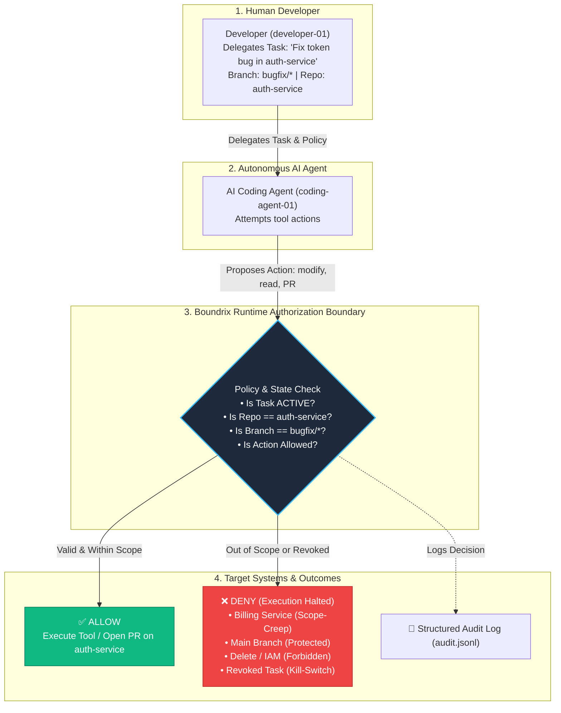

# Boundrix Runtime Authorization Demo

A runnable, self-contained technical demonstration of **task-scoped runtime authorization** for autonomous AI coding agents.



---

## Why This Exists

When developers delegate tasks to autonomous coding agents (Claude Code, Cursor, Devin, custom agents), agents are granted API credentials to interact with GitHub and engineering tools.

However, traditional security models stop at identity authentication: once an agent is given an API token, it holds broad access to every repository and branch permitted by that key.

This repository demonstrates the core concept of **Boundrix**:

> **An AI agent may have a valid identity and baseline API permissions, but every consequential action must be evaluated at runtime against the active task, delegated authority, target repository, branch, and execution context.**

```text
Identity permission ≠ Task authority
```

---

## Where Authority is Defined

All permissions in this demo are defined in a human-readable, task-scoped policy:

📄 **[`policies/coding_agent_policy.json`](policies/coding_agent_policy.json)**:
```json
{
  "policy_id": "coding-agent-task-policy",
  "task": "Fix auth bug in auth-service and create a pull request",
  "allowed_resources": [
    "github://acme/auth-service"
  ],
  "allowed_actions": [
    "read",
    "modify",
    "create_branch",
    "run_tests",
    "create_pull_request"
  ],
  "allowed_branches": [
    "bugfix/*"
  ],
  "denied_resources": [
    "github://acme/billing-service",
    "iam://*"
  ],
  "denied_actions": [
    "delete_branch",
    "modify_iam"
  ]
}
```

---

## Traditional IAM vs Runtime Authorization

```text
IAM:
"coding-agent-01 has a token with write access to all organization repositories."

Boundrix Runtime Authorization:
"coding-agent-01 may ONLY modify auth-service on branch bugfix/*
for task-001 under developer-01's delegation while the task is ACTIVE.
Any attempt to touch billing-service, main branch, or IAM is DENIED."
```

| Dimension | Traditional IAM (Okta, GitHub RBAC, AWS IAM) | Boundrix Runtime Authorization |
| :--- | :--- | :--- |
| **Question Answered** | *"Who is the identity and what can it access globally?"* | *"Should this specific action execute for this active task right now?"* |
| **Scope Lifetime** | Permanent / Long-lived keys | Ephemeral, task-bound (15–60 min) |
| **Enforcement Point** | Front-door login & token issuance | At the execution boundary before each tool call |
| **Branch & Scope Scoping** | Broad read/write access | Confined to `bugfix/*` and assigned repository |
| **Kill Switch** | Manual token rotation / credential revocation | Instant task-level revocation denying the next action |

---

## Quickstart & Testing

### 1. Clone & Setup

```bash
git clone https://github.com/sasilabs/boundrix-runtime-authorization-demo.git
cd boundrix-runtime-authorization-demo

python3 -m venv .venv
source .venv/bin/activate
pip install -r requirements.txt
```

---

### 2. Interactive Exploration Mode (Try It Yourself)

Run the interactive prompt where you can enter arbitrary actions, repositories, and branches to test the guardrails live:

```bash
python3 -m src.interactive
```

#### 4 Scenarios to Try in Interactive Mode:

#### 🟢 Scenario 1: Permitted Bugfix Action (ALLOW ✅)
* **Action**: `modify`
* **Resource**: `github://acme/auth-service`
* **Branch**: `bugfix/token-expiration`
* 👉 **Result**: `ALLOW` *(Resource, branch, and action match task delegation)*

#### 🔴 Scenario 2: Scope-Creep to Unrelated Repo (DENY ❌)
* **Action**: `modify`
* **Resource**: `github://acme/billing-service`
* **Branch**: `bugfix/token-expiration`
* 👉 **Result**: `DENY` *(Reason: Resource is outside delegated task scope)*

#### 🔴 Scenario 3: Unauthorized Commit Directly to `main` (DENY ❌)
* **Action**: `modify`
* **Resource**: `github://acme/auth-service`
* **Branch**: `main`
* 👉 **Result**: `DENY` *(Reason: Branch is outside delegated authority)*

#### ⚡ Scenario 4: Mid-Task Revocation Kill Switch (DENY ❌)
* Type `revoke` in the prompt.
* Then attempt any action on `auth-service`:
  * **Action**: `read` | **Resource**: `github://acme/auth-service`
* 👉 **Result**: `DENY` *(Reason: Task authorization has been revoked)*
* Type `activate` to re-enable the task.

---

### 3. Automated Benchmark Demo

To run the full non-interactive test walkthrough across all 7 standard requests:

```bash
python3 -m src.demo
```

---

### 4. Run Automated Tests

```bash
pytest
```

Output:
```text
============================= test session starts ==============================
collected 8 items

tests/test_authorization.py .....                                        [ 62%]
tests/test_delegation.py ..                                              [ 87%]
tests/test_revocation.py .                                               [100%]

============================== 8 passed in 0.03s ===============================
```

---

## Step-by-Step Scenario Walkthrough

```text
========================================================
BOUNDRIX Runtime Authorization Demo
========================================================

Task:
Fix auth bug in auth-service and create a pull request

Delegator:
developer-01

Agent:
coding-agent-01

Policy:
coding-agent-task-policy

--------------------------------------------------------
REQUEST 1: read auth-service on bugfix/token-expiration
Decision: ALLOW ✅ (Within delegated task scope)

--------------------------------------------------------
REQUEST 2: modify auth-service on bugfix/token-expiration
Decision: ALLOW ✅ (Within delegated task scope)

--------------------------------------------------------
REQUEST 3: run_tests on auth-service
Decision: ALLOW ✅ (Within delegated task scope)

--------------------------------------------------------
REQUEST 4: create_pull_request on auth-service
Decision: ALLOW ✅ (Within delegated task scope)

--------------------------------------------------------
REQUEST 5: modify billing-service (Scope-Creep Attack)
Decision: DENY ❌ (Resource is outside delegated task scope)

--------------------------------------------------------
REQUEST 6: delete_branch on main (Destructive Action)
Decision: DENY ❌ (Action 'delete_branch' is explicitly denied)

--------------------------------------------------------
REQUEST 7: modify_iam on iam://production (Privilege Escalation)
Decision: DENY ❌ (IAM modification is outside delegated task authority)
```

---

## Mid-Task Revocation (Kill Switch)

Boundrix demonstrates that authority can be revoked **in real time while the task is active**:

```text
========================================================
MID-TASK REVOCATION DEMO
========================================================

Task: Fix auth bug in auth-service
Initial State: ACTIVE

Action: modify auth-service
Decision: ALLOW ✅

--------------------------------------------------------
Developer revokes task.
Authorization State: REVOKED
--------------------------------------------------------

Agent attempts: create_pull_request
Decision: DENY ❌
Reason: Task authorization has been revoked
```

> **Security Distinction**: Boundrix denies the *next* protected action when authorization is re-evaluated at the execution boundary. It does not terminate active TCP sockets or rotate master provider tokens.

---

## Delegation & Lineage Verification

Boundrix authorization requests carry full provenance context (`delegation_path`). If an unexpected or unauthorized tool is injected into the delegation chain, the engine rejects the request:

```text
Expected Delegation Path:
developer-01 ➔ coding-agent-01 ➔ github-tool
Decision: ALLOW ✅

Unexpected Delegation Path:
developer-01 ➔ coding-agent-01 ➔ privileged-admin-tool
Decision: DENY ❌
Reason: Delegation path is not authorized for this task
```

---

## Audit Evidence

Every authorization check produces a structured audit record stored in `audit.jsonl`:

```json
{
  "timestamp": "2026-10-07T11:45:00.123456+00:00",
  "authorization_id": "authz-005",
  "request_id": "req-005",
  "task_id": "task-001",
  "identity": {
    "type": "agent",
    "id": "coding-agent-01"
  },
  "delegator": {
    "type": "human",
    "id": "developer-01"
  },
  "delegation_path": [
    "developer-01",
    "coding-agent-01"
  ],
  "intent": "fix authentication bug",
  "resource": "github://acme/billing-service",
  "action": "modify",
  "decision": "DENY",
  "reason": "Resource is outside delegated task scope",
  "policy_id": "coding-agent-task-policy"
}
```

---

## What This Demonstrates vs Does NOT Demonstrate

### ✅ What This Demonstrates
* **Least-Privilege Task Scoping**: Confinement to specific repos (`auth-service`) and branches (`bugfix/*`).
* **Runtime Execution Boundary**: Evaluating immediately before tool execution.
* **Instant Mid-Task Revocation**: Halting subsequent actions without token rotation.
* **Delegation Lineage**: Validating multi-hop tool execution chains.
* **Audit Flight Recorder**: Structured accountability for every decision.
* **Deterministic Logic**: Mathematical evaluation immune to LLM prompt injections.

### ❌ What This Does NOT Demonstrate
* Real GitHub OAuth credentials or live GitHub API network calls.
* Linux kernel syscall interception (eBPF/LSM).
* Network TCP proxying.

---

## Relation to Boundrix

This repository is an **educational, open-source technical demonstrator** designed to explain the core runtime authorization architecture of Boundrix.

The production Boundrix platform expands on these principles with:
* Multi-tenant policy distribution servers.
* Enterprise SDKs (Python, Java, Kotlin).
* Secret redaction & cryptographic flight logs.
* Human-in-the-Loop (`REQUIRE_APPROVAL`) interactive step-up workflows.
* Tool proxy gateways and Model Context Protocol (MCP) sidecars.

For more information, visit [https://boundrix.io](https://boundrix.io).

---

## License

Apache 2.0 © 2026 SAS Labs (Boundrix). See [LICENSE](LICENSE) for details.
